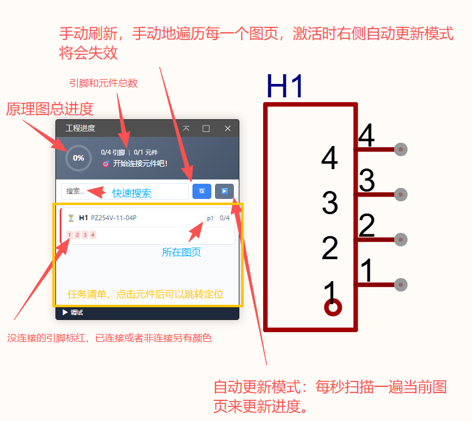
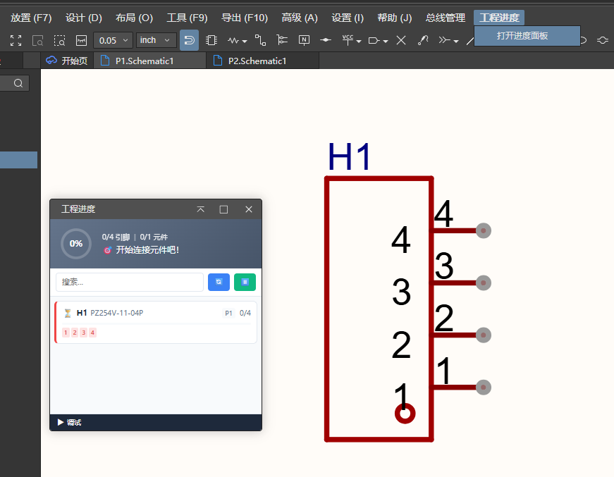
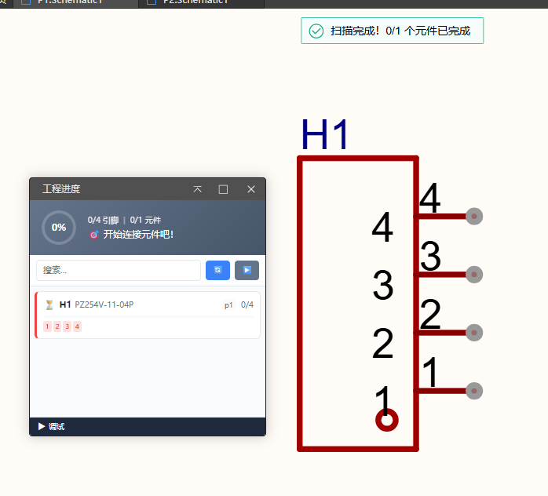
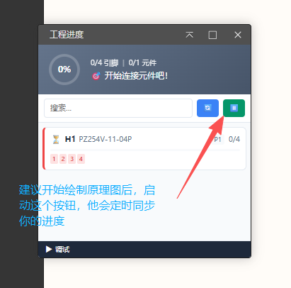
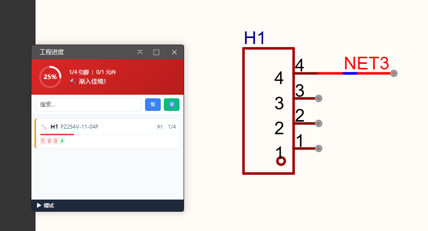
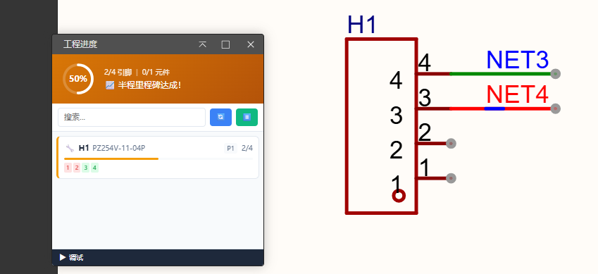
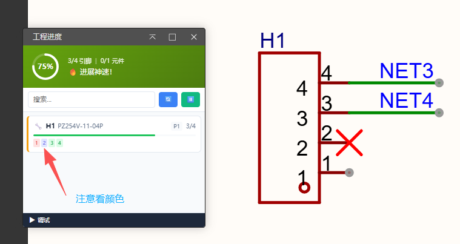
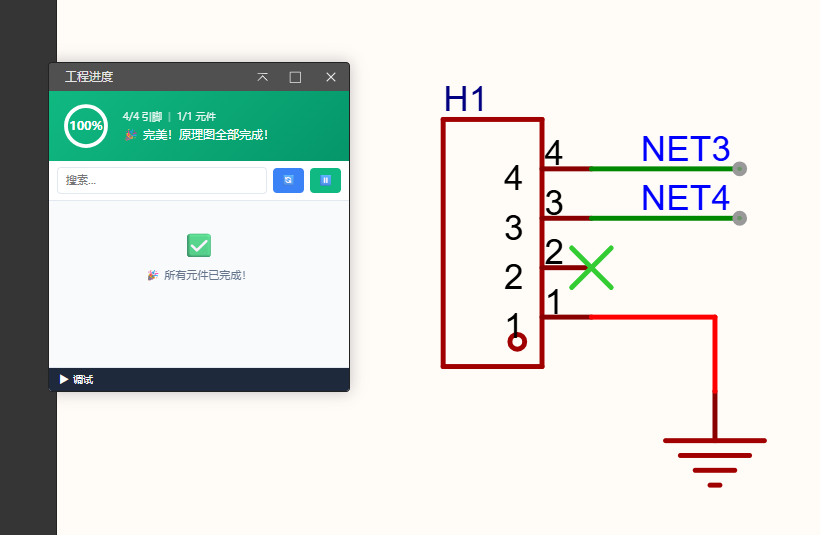
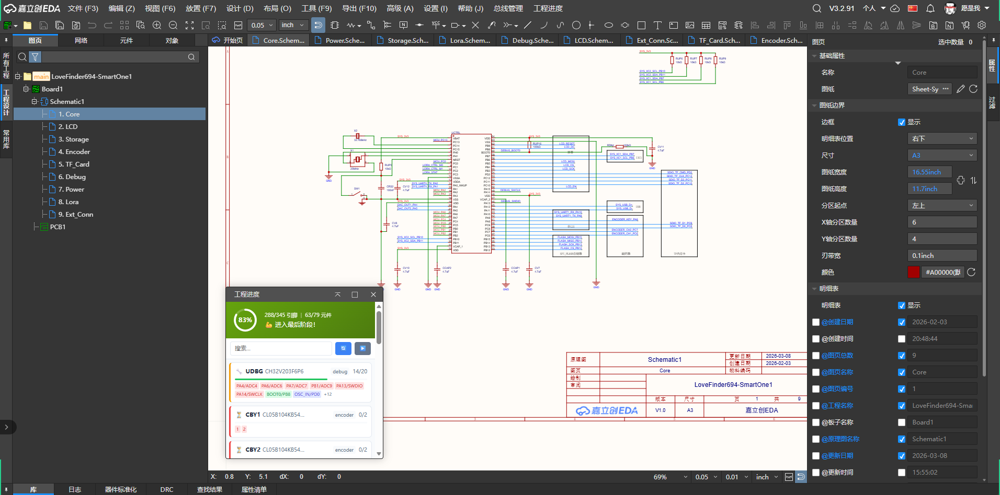
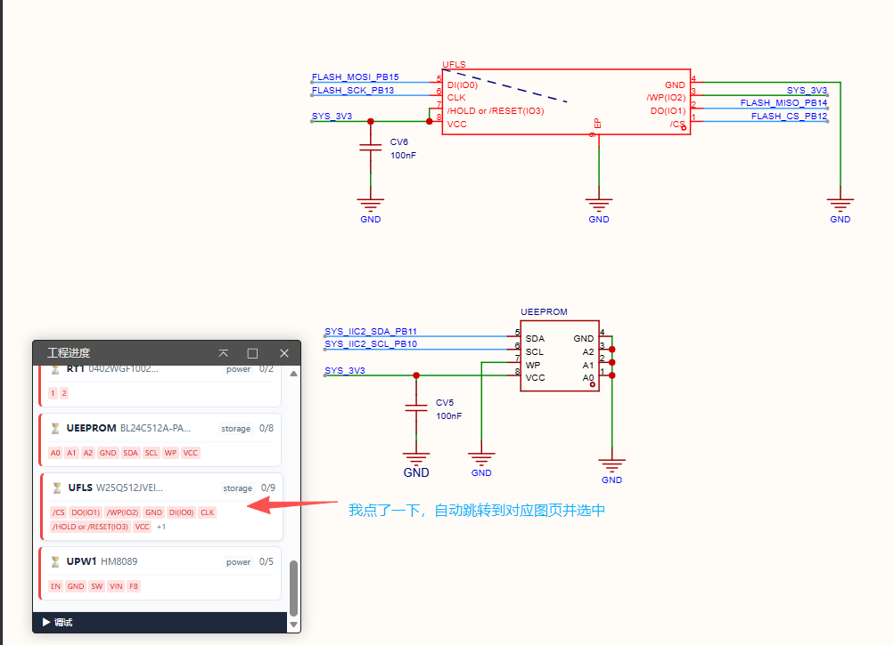

[简体中文](#)

# LoveFinderSeries*NO.732-DadLine*

原理图做到哪儿了？进度还有多少没完成？

> 请在配置中勾选：”显示在顶部菜单“

> 本项目仓库：[[LoveFinder732-DadLine](https://github.com/48832668/LoveFinder732-DadLine)]

## 简介

一鼓作气，再而衰、三而竭。

DDL快到了？月底还没打板？在做了！我很快就能完成！

“巴依老爷，这表怎么倒着走啊”？

时间充裕，项目明朗，而你迟迟不肯动手把刚开的新坑项目的原理图画好，或者画到一半直接撒手，直到DDL降临到头上开始催命，你作为一个开发小白/大白/小黑/大黑为什么不停下来思考自己为什么会如此拖沓？

这还真不一定是你的问题，也许是LCEDA的情绪价值没给到位，也许是你被原理图的规模吓到了，但我们可以一步步拆解，一步步走下去，只要0.01%的进度推进了，也总比原地踏步好。

很多人更愿意一口气画完原理图，我也是，一个复杂的扩展坞原理图一坐就是一下午，但这非常磨练人的意志。

为了能够让我们在绘制原理图时更直观地了解原理图的开发进度，我开发了这个插件，它实现了可视化的原理图开发进度，并可以帮助你快速定位还没有完成连接的元件。

经过大量测试，发现他对于V2迁移到V3的工程的原理图兼容性存在问题，目前在V3.2+版本上测试，插件是正常运作的。

## 上手

插件只有一个界面，很简单:

依旧交代开发场景：以有两个图页分页的原理图，图页1有一个4引脚排针为例子，请打开菜单栏中工程进度的唯一一个菜单选项（如果没有显示在顶部菜单，请前往插件配置页勾选，否则只能前往高级选项寻找本插件）：

开局会遍历你的原理图每一个图页，别怕，闪烁是正常的。

接下来我们开始接入一点引脚：

那么现在我们来试试实战：

**警告：当前插件对于从旧版本迁移的工程存在兼容性问题，我已经尽力解决这些问题，但是当前api还不完善，目前保证V3.2以上的新工程可以完美使用这个插件**

## 开源许可

本开发工具组使用 [Apache License 2.0](https://choosealicense.com/licenses/apache-2.0/) 开源许可协议

[简体中文](#)
